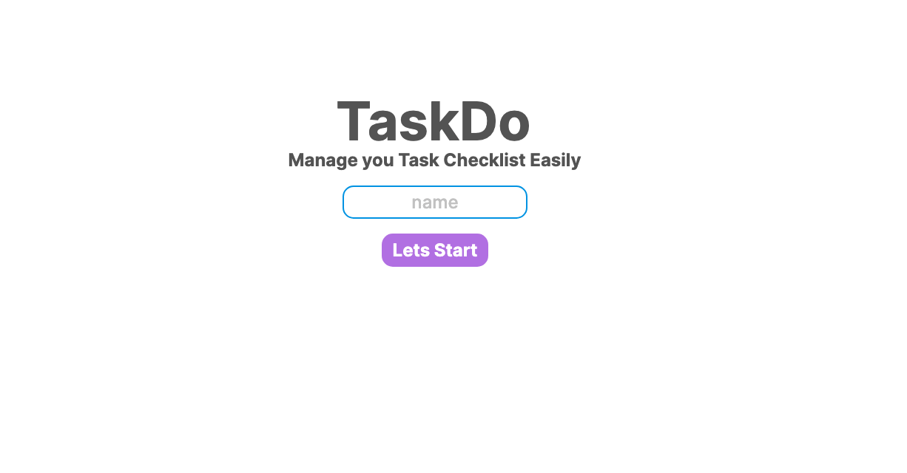
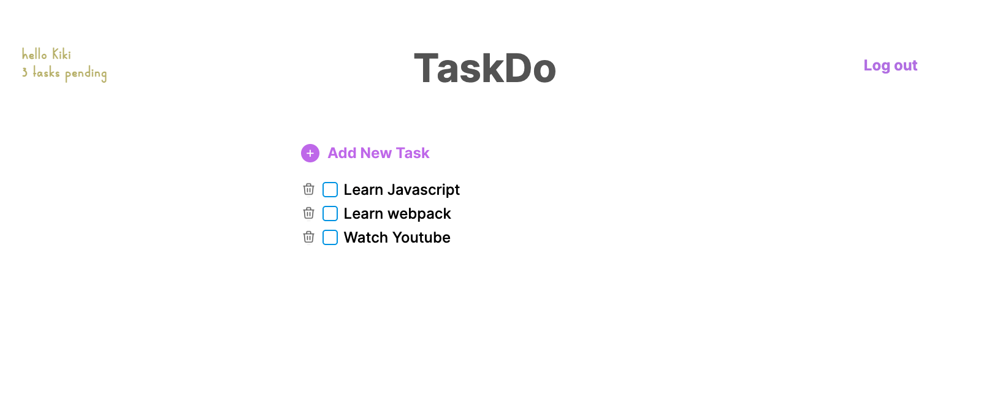
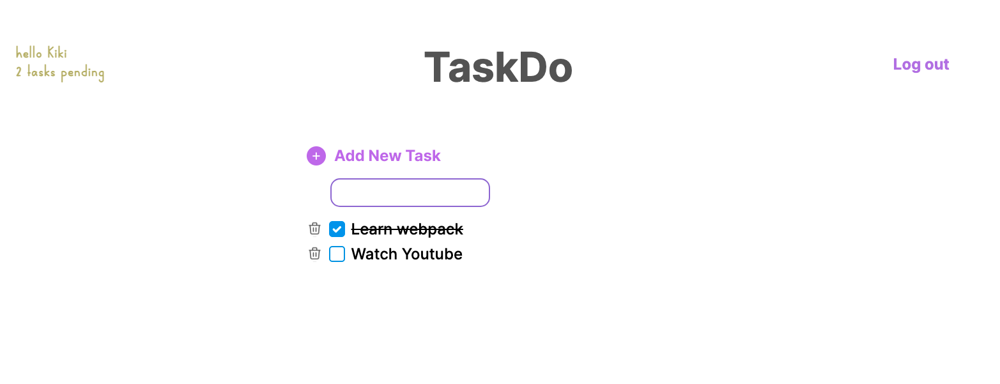

# Todolist Web App

A web app use for learn webpack

## Enviroment Setup 
Webpack reference: https://webpack.js.org/guides/getting-started/
### Quick setup
```shell
npm install
npm start
```
## Project Requirement

#### Functional
- Login valid users
- Show tasks current authenticated user have to do
- Check task
- Delete task
- Add new task
- Logout current user

### Non-Functional
- Currently no database connect and data is hardcoded
#### Tech stack
- Javascript/HTML/CSS
- Webpack

#### Page
- Login

- TaskList 

- Add/Check/Delete task Toggle

